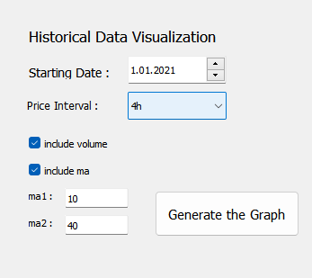

# PyTrade: Detailed Project Overview

## Introduction

PyTrade is a Python project  designed to collect and analyze detailed information about the cryptocurrency market with the user interface. The script utilizes the Binance Python API to gather data on coin prices, including close and open prices, trading volume, and other essential market metrics. PyTrade offers a user-friendly interface that enables users to interact with their Binance accounts, view their account balances (both cash and coins), access a list of available coins in their balance, create coin graphs, and add Moving Average (MA) and volume indicators to these graphs. Additionally, the script incorporates a sophisticated signal analysis component, leveraging various indicators such as Exponential Moving Average (EMA), Relative Strength Index (RSI), and Bollinger Bands to provide buy or don't buy signals for the listed coins.

## Data Collection and Interface

PyTrade begins its process by connecting to the Binance exchange through the Binance Python API. By doing so, it gains access to real-time market data for various cryptocurrencies. This data includes the prices of coins at different time intervals (close and open prices), trading volume, and other relevant trading information. The collected data is stored in Pandas DataFrames, which facilitate efficient data manipulation and analysis.

The user interface serves as an essential component of PyTrade, providing users with a seamless experience to interact with their Binance account. Through the interface, users can view their account balance, which includes both their cash and coins holdings. Furthermore, they can access a comprehensive list of available coins along with the ability to create graphs that visually represent the historical price movements of selected cryptocurrencies.

## Signal Analysis - Technical Indicators

The heart of PyTrade lies in its  signal analysis component, which assists users in making informed trading decisions. The script applies four technical indicators to analyze the potential market trends for listed coins:

1. Exponential Moving Average (EMA) Indicator: The EMA is a trend-following indicator that smooths out price data to identify trends over specified time periods. By calculating the EMA values for different coins, PyTrade gains insights into their price trends and potential market directions.

2. Relative Strength Index (RSI) Indicator: The RSI is a momentum oscillator that measures the speed and change of price movements. It ranges from 0 to 100 and is used to identify overbought or oversold conditions in the market. PyTrade utilizes the RSI to assess the strength of listed coins and identify potential reversal points.

3. Bollinger Bands Indicator: Bollinger Bands consist of a middle SMA line and two standard deviation lines above and below it. These bands help identify potential price breakouts and volatility changes in the market. PyTrade employs Bollinger Bands to assess the price volatility and potential trading opportunities for the listed coins.

## Signal Analysis - Machine Learning

Having calculated the necessary indicators, PyTrade proceeds with machine learning techniques to generate buy or don't buy signals for the listed coins. This process involves the following steps:

1. Dataset Preparation: The dataset is constructed using the calculated EMA, RSI, and Bollinger Bands values for the listed coins. Historical price data is used to create both training and testing datasets.

2. Random Forest Classifier: PyTrade uses the Random Forest Classifier, a popular machine learning algorithm, to build predictive models based on the datasets. The classifier considers multiple decision trees and outputs a binary (0 or 1) prediction for each coin. A prediction of 1 implies a buy signal, while 0 indicates a don't buy signal.

## Signal Analysis - Reinforcement Learning

In addition to machine learning, PyTrade also incorporates reinforcement learning for further signal analysis. Specifically, it employs the Advantage Actor-Critic (A2C) algorithm, a popular reinforcement learning technique, to make trading decisions. This process involves creating an environment for the algorithm, allowing it to simulate trades and generate buy or don't buy signals based on the results. The algorithm repeats this process several times, optimizing its performance to provide the most accurate signals.

## User Interface

PyTrade provides a user-friendly interface that allows users to interact with their Binance account and access valuable information about the cryptocurrency market.First user put their api_key and api_Secret in order to access their balance

### Features

1. Account Balance: The interface displays the user's account balance, which includes both the cash and coins holdings in their Binance account. This feature helps users stay informed about their available funds for trading.

2. List of Available Coins: Users can easily access a comprehensive list of available coins in their balance. This feature enables users to quickly identify the cryptocurrencies they hold and plan their trading strategies accordingly.

4. Coin Graphs: PyTrade allows users to create interactive graphs for individual coins. These graphs visualize the historical price movements of selected cryptocurrencies, providing insights into their past performance.

5. Technical Indicators: Users can add Technical Indicators such as Moving Averages (MA) and volume data to the coin graphs. These indicators assist in identifying trends and potential trading opportunities.

